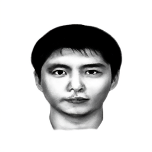
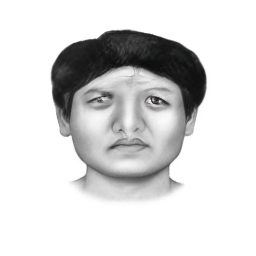
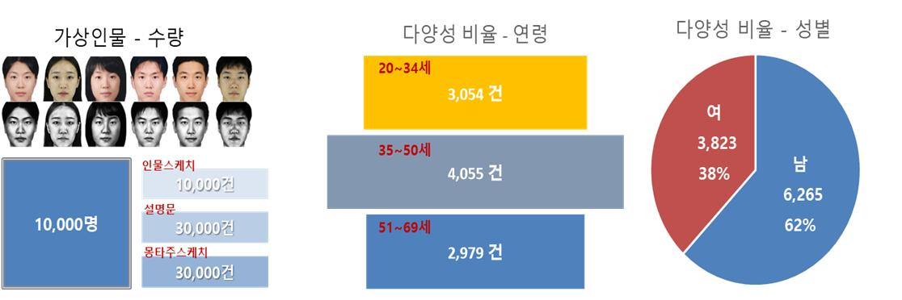

# 몽타주 그리는 인공지능 Text to Montage

사람에 대한 묘사를 기반으로 몽타주 이미지를 자동으로 생성하는 [KoDALLE](https://github.com/KR-HappyFace/KoDALLE) 기반 모델

| Text | Generated montage |
| --- | --- |
| 볼이 넓은 계란형 얼굴이며 앞머리가 이마의 양쪽 끝을 가리고 있어 모양은 보이지 않는다.   오른쪽 턱의 각진 부분이 왼쪽에 비해 아래로 내려와 있고 왼쪽은 약간 완만한 형태이다.  턱끝으로 내려오는 턱모양은 약간 둥근형으로 보인다. 왼쪽의 볼이 더 평평하고 넓은 편이다. |  |
| 이마라인 가운데가 아래로 살짝 내려와 있어 M모양을 띄고 있으며 가르마의 구분 없이 모두 올려져 있으나 헤어라인 가운데에서 살짝 오른편으로 헤어젤을 바른 듯 조금 나뉜 모습도 보인다. 옆머리는 왼쪽은 귓바퀴 시작 지점까지 내려와 있으며 오른쪽은 귀에 바로 닿을 듯 내려와 있다. |  |
| 각진 얼굴에 광대는 매끄럽고 큰 볼을 가지고 있어 약간 후덕한 인상을 준다. 눈매의 라인이 부드러워 따뜻한 인상을 주며 누구에게나 친절을 베풀 것 같은 인물이다. 입매가 부드럽고 약간 얇은 듯해서 말하기 좋아하는 사람 같기도 하다. |  |
| 눈매와 입매가 부드럽고 미소짓고 있는 모습으로  성품이 착하고 유한 사람으로 보인다. 약간 여성스러운 성격일 수도 있을 것 같으며 누구에게나 친절하고 어진 모습으로 대해주는 편안한 사람으로 느껴진다. |  |
| 눈이 작고 여성스러운 이미지를 가지고 있으며 입술은 도톰하다. |  |

## Dataset

[페르소나 기반의 가상 인물 몽타주 - AIHub](https://www.aihub.or.kr/aihubdata/data/view.do?dataSetSn=618)



## Training Process

1. Download dataset from above
2. Preprocess dataset using [preprocess.ipynb](preprocess.ipynb)
3. Train [VQGAN](https://github.com/kairess/taming-transformers)
4. Extract `klue/roberta-large` models (run [extract_emb_models.py](extract_emb_models.py))
5. Train KoDALLE

## Inference Pipeline

- [test.ipynb](test.ipynb)
- [Gradio App](app.py)

## Wandb Logs

- VQGAN https://wandb.ai/kairess/DALLE-Couture?workspace=user-kairess
- KoDALLE https://wandb.ai/kairess/optimization?workspace=user-kairess

---

# KoDALLE

[](https://github.com/KR-HappyFace/KoDALLE/blob/main/README.pdf) [](https://wandb.ai/happyface-boostcamp/final)

[](https://github.com/KR-HappyFace/KoDALLE/blob/main/README.pdf)

**Training DALLE from scratch, utilizing target language's PLMs' token embedding layer and position embedding layer as text encoder.**

### Background

[📂 For the project details, please refer to README.pdf](https://github.com/KR-HappyFace/KoDALLE/blob/main/README.pdf)

- Training DALLE model from scratch demands large size paired dataset of images and captions. For example, OpenAI DALLE is trained with more than 250 million text-image pairs for the training.
- If the dataset isn’t large enough or is limited to specific domains, number of vocabularies in the trained DALLE model are insufficient. For instance, 1 million text captions of K-Fashion dataset only consists of more or less than 300 tokens.
- Therefore, inferencing from such DALLE models could be problematic if the given sentence query is unconnected to the originally trained captions’ text dataset.

### KoDALLE's Result on Small Size Fashion Dataset

|                        |      OpenAI’s DALLE       |           KoDALLE of HappyFace            |
| :--------------------: | :-----------------------: | :---------------------------------------: |
| **Train Dataset Size** |     250 Million Pairs     |             0.8 Million Pairs             |
|      **#Params**       |        12 Billion         |                428 Million                |
|      **#Layers**       |         64 Layers         |                 16 Layers                 |
| **Computing Resource** |     1024 x V100 16GB      |               1 x V100 32GB               |
|    **Text Encoder**    | 16384 Vocab x 512 Dim BPE | 32000 Vocab x 1024 Dim klue/roberta-large |
|   **Image Encoder**    |           VQVAE           |                   VQGAN                   |
|     **Optimizer**      |           AdamW           |                   AdamW                   |
|   **Learning Rate**    |          4.5e-5           |                  3.0e-5                   |
|    **Weight Decay**    |          4.5e-3           |                  3.0e-3                   |
|    **LR Scheduler**    |     ReduceLROnPlateau     |                     -                     |

**The team constructed Text to Fashion Design DALLE model in Korean language with less than 100k text-image sampled pairs.**

|                     |                                                                                                                                                                                                                      |
| :-----------------: | :------------------------------------------------------------------------------------------------------------------------------------------------------------------------------------------------------------------: |
|     **Caption**     | 하의에서 색상은 스카이블루이다. 상의에서 기장은 롱이다. 색상은 화이트이다. 카테고리는 블라우스이다. 디테일에는 셔링이다. 소매기장은 반팔이다. 소재에는 실크이다. 프린트에는 무지이다. 넥라인은 브이넥이다. 핏은 노멀 |
| **Generated Image** |                                                                                                                            |

|                     |                                                                                                                   |
| :-----------------: | :---------------------------------------------------------------------------------------------------------------: |
|     **Caption**     | 아우터는 색상이 카키 소재가 우븐 핏이 루즈인 코트이다. 하의는 색상이 네이비 소재가 데님 핏이 스키니인 청바지이다. |
| **Generated Image** |                         |

|                     |                                                                                                                                                                                                                         |
| :-----------------: | :---------------------------------------------------------------------------------------------------------------------------------------------------------------------------------------------------------------------: |
|     **Caption**     | 하의에서 기장은 발목이다. 색상은 블루이다. 카테고리는 스커트이다. 소재에는 데님이다. 핏은 와이드이다. 상의에서 색상은 화이트이다. 카테고리는 블라우스이다. 디테일에는 셔링이다. 소매기장은 반팔이다. 소재에는 우븐이다. |
| **Generated Image** |                                                                                                                               |

|                     |                                                                                                                                                                                                                                                                       |
| :-----------------: | :-------------------------------------------------------------------------------------------------------------------------------------------------------------------------------------------------------------------------------------------------------------------: |
|     **Caption**     | 상의에서 기장은 노멀이다. 상의에서 색상은 화이트이다. 상의에서 서브색상은 블랙이다. 상의에서 카테고리는 티셔츠이다. 상의에서 소매기장은 반팔이다. 상의에서 소재에는 저지이다. 상의에서 프린트에는 레터링이다. 상의에서 넥라인은 라운드넥이다. 상의에서 핏은 루즈이다. |
| **Generated Image** |                                                                                                                                                                             |

### Methodology

Experimentations were conducted with the following Korean Transformers Models’ embedding layers. The team selected klue/roberta-large as baseline in the repository considering the size of the model.

- **[klue/roberta-large](https://huggingface.co/klue/roberta-large): Vocab Size of 32000, Embedding Dimension of 1024.**
- [KoGPT Trinity of SKT](https://huggingface.co/skt/ko-gpt-trinity-1.2B-v0.5): Vocab Size of 51200, Embedding Dimension of 1920.
- [KoGPT of Kakao Brain](https://huggingface.co/kakaobrain/kogpt): Vocab Size of 64512, Embedding Dimension of 4096.

KoDALLE with klue/roberta-large's wpe and wte were trained on 32GB V100 GPU environment. Hyperparams related to the DALLE's model size are following.

```
'BATCH_SIZE': 40
'DEPTH': 16
'TEXT_SEQ_LEN': 128
'VOCAB_SIZE': 32000
'MODEL_DIM': 1024
'ATTN_TYPES': 'full'
'DIM_HEAD': 64
'HEADS': 8
```

- DALLE model is composed on [lucidrain's DALLE-pytorch](https://github.com/lucidrains/DALLE-pytorch)
- Image encoder is constructed based on [VQGAN(Taming Transformers)](https://github.com/CompVis/taming-transformers#training-on-custom-data)

### Significance

- Offers promising result for training from scratch on specific domains with small size dataset.
- Introduces solution for domain specific DALLE & CLIP models to be robust on input sentence.
- Recommends adequate text-to-image model size for given computation resource.
- Suggests effortless method of creating DALLE & CLIP model for own languages if pretrained language model is available.

---

### WIP

- [x] Add image-caption reranker(EfficientNet + Klue/roberta-large)
- [x] Model trained with 500k text-image pairs.
- [x] Modulize in python code.
- [x] Update Inference code.
- [ ] Update FID and IS metrics on test and validation dataset.

### Citations

```bibtex
@misc{ramesh2021zeroshot,
    title   = {Zero-Shot Text-to-Image Generation},
    author  = {Aditya Ramesh and Mikhail Pavlov and Gabriel Goh and Scott Gray and Chelsea Voss and Alec Radford and Mark Chen and Ilya Sutskever},
    year    = {2021},
    eprint  = {2102.12092},
    archivePrefix = {arXiv},
    primaryClass = {cs.CV}
}

```

```bibtex
@misc{esser2021taming,
    title   = {Taming Transformers for High-Resolution Image Synthesis},
    author  = {Patrick Esser and Robin Rombach and Björn Ommer},
    year    = {2021},
    eprint  = {2012.09841},
    archivePrefix = {arXiv},
    primaryClass = {cs.CV}
}
```
